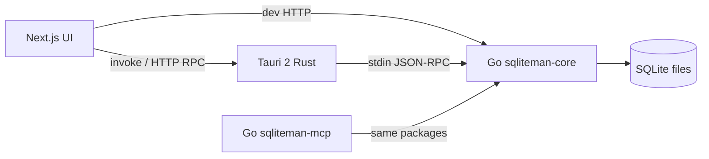

# Architecture

| Layer | Role |
|---|---|
| `apps/web` | Dense IDE UI (static export) |
| `apps/desktop` | Window, dialogs, sidecar lifecycle |
| `core` | SQLite engine + JSON-RPC (`open`, `query`, `schema`, …) |
| `mcp` | MCP tools over the same engine |
| `python/utils` | Optional CSV/XLSX scripts |

Driver: pure-Go `modernc.org/sqlite` for easy cross-compile in CI.
